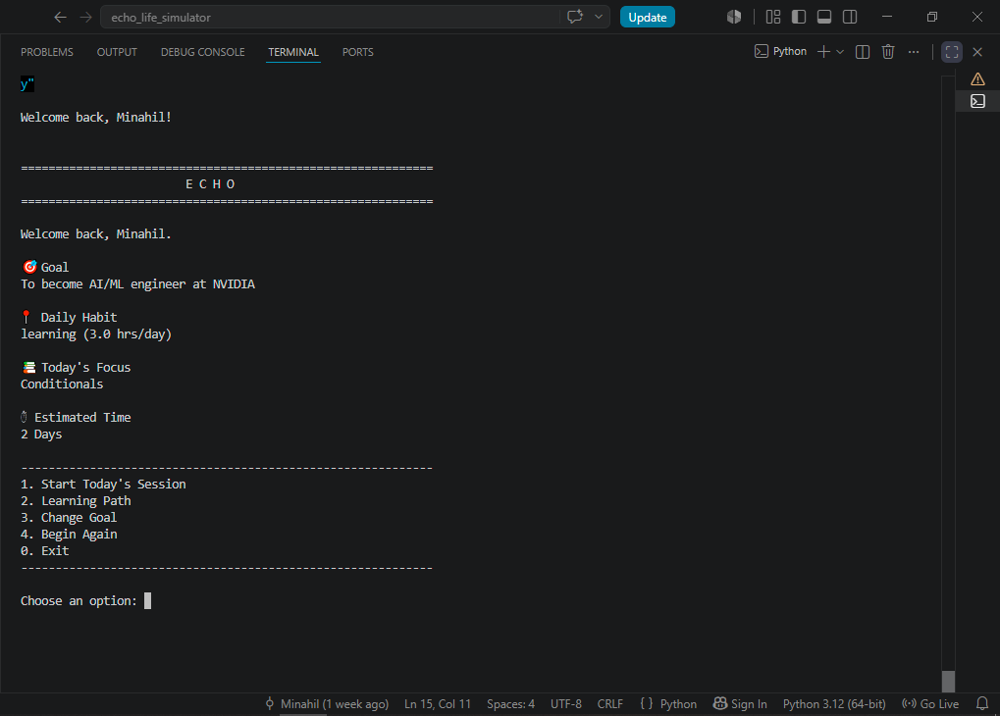
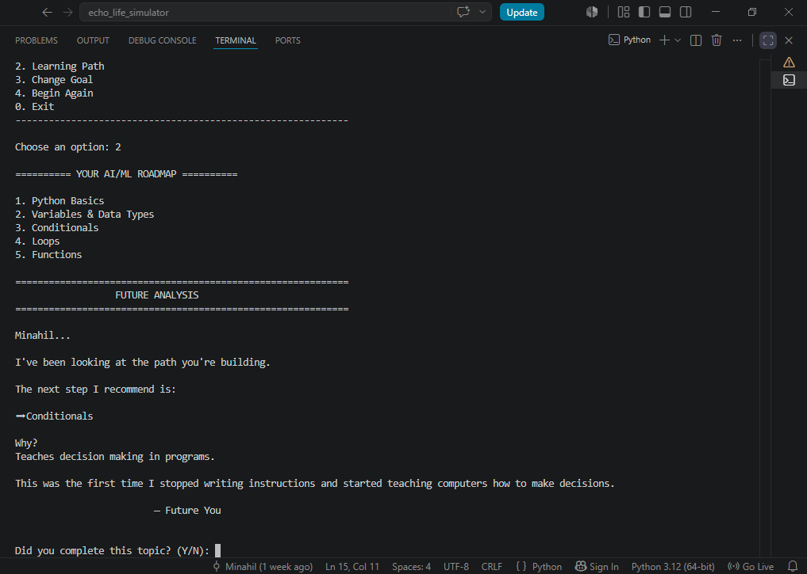
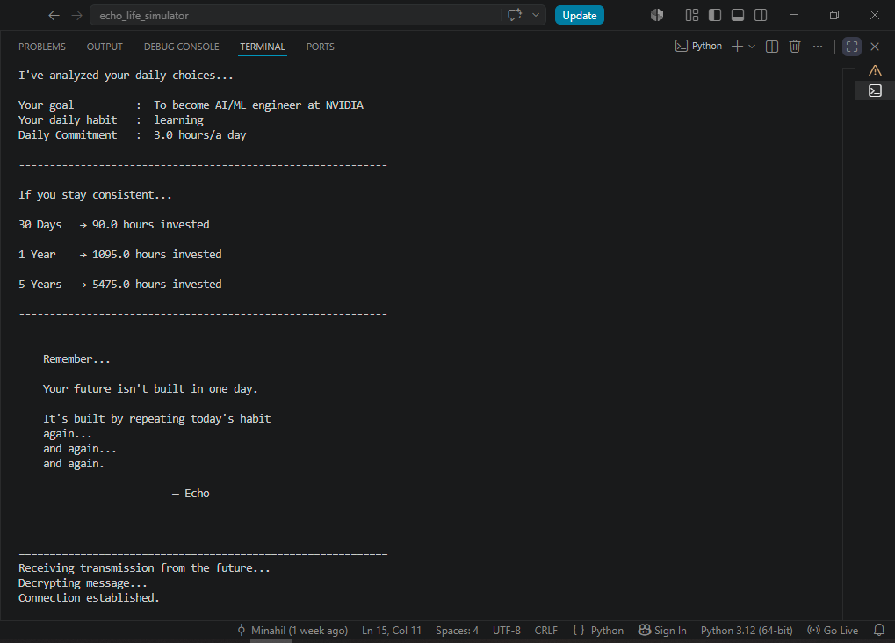

# 🌌 Echo – Life Decision Simulator

A motivational Python application that transforms your daily habits into a visual journey toward your future.

Instead of predicting your future, **Echo** helps you build it—one habit, one goal, and one learning session at a time.

---

# ✨ Features

## 👤 Personal Profile

Create your own profile and let Echo remember your journey.

Features:

* Persistent user profile
* Goal management
* Daily habit tracking
* Daily study hours
* JSON-based data storage

---

## 🏠 Personalized Dashboard

Every time you return, Echo welcomes you with your personal dashboard.

Displays:

* 🎯 Current Goal
* 📍 Daily Habit
* 📚 Current Learning Topic
* ⏱ Estimated Learning Time

---

## 🧠 AI/ML Learning Roadmap

Follow a structured roadmap toward becoming an AI/ML Engineer.

Features:

* Beginner-friendly roadmap
* Dynamic next-topic recommendation
* Difficulty level
* Estimated learning time
* Personalized guidance from Echo

---

## 📈 Learning Progress

Track your journey one topic at a time.

Features:

* Completed topics tracking
* Automatic next recommendation
* Progress persistence using JSON

---

## 🎯 Goal Management

Goals change.

Echo grows with you.

Features:

* Update your career goal anytime
* Automatically saves changes

---

## 🔄 Profile Reset

Want a fresh start?

Echo allows you to completely reset your journey and begin again.

---

## 💬 Future Echo Simulation

Experience a motivational conversation with your future self based on your current habits.

Includes:

* Daily investment calculations
* 30-Day projection
* 1-Year projection
* 5-Year projection
* Personalized motivational message

---

# 💾 Data Storage

Echo automatically saves your progress using JSON.

Files:

* `profile.json`

---

# 🛠 Technologies Used

* Python
* JSON
* File Handling
* Functions
* Dictionaries
* Lists
* Modular Programming
* Git
* GitHub

---

# ▶ How to Run

Clone the repository

```bash
git clone https://github.com/minahilmuqadus/echo-life-simulator.git
```

Go into the project folder

```bash
cd echo-life-simulator
```

Run

```bash
python main.py
```

---

# 📸 Screenshots

🏠 Dashboard



---

🧠 Learning Path



---

💬 Future Echo



---

# 🚀 Future Improvements

## Version 1.1

* Daily Echo mode
* XP & Leveling System
* Learning streak tracking
* Improved dashboard

## Version 2.0

* Multiple career roadmaps
* AI-powered recommendations
* Progress analytics
* Achievement system
* Export learning reports

---

# 👩‍💻 Author

Made with ❤️ by **Minahil**

Computer Science student passionate about Artificial Intelligence and Machine Learning.

---

> **"Your future isn't built in one day. It's built by repeating today's habit again... and again... and again."**
> **— Echo**
